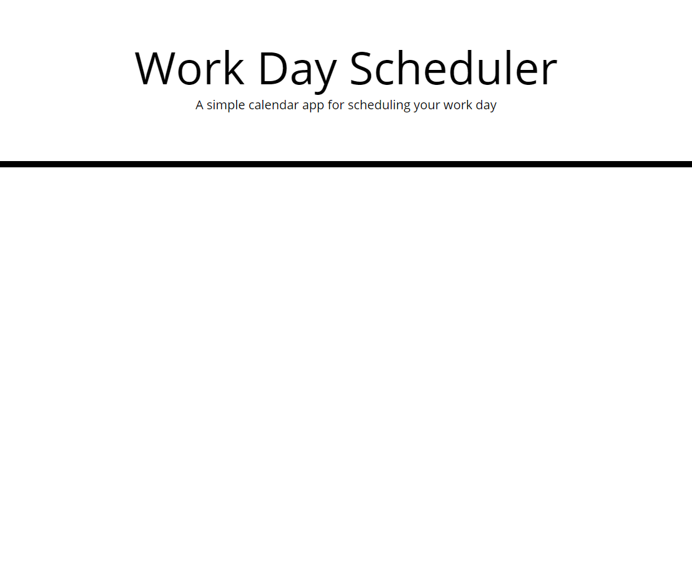
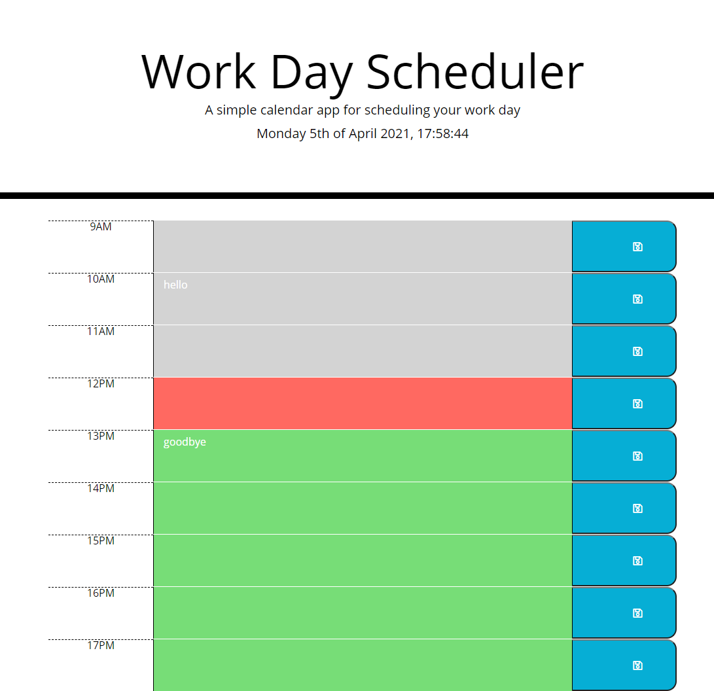
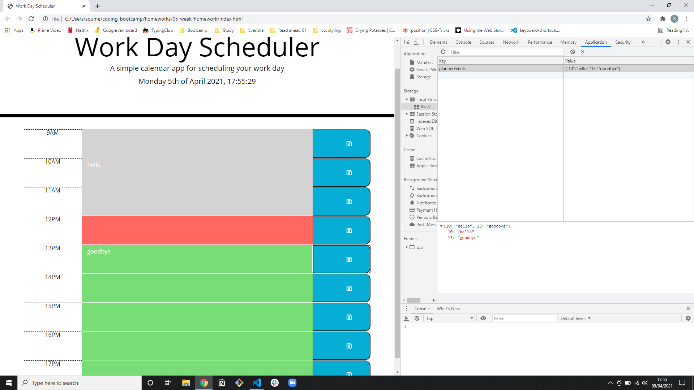

# Daily Work Scheduler

## Table of Contents

- [Daily Work Scheduler](#daily-work-scheduler)
  - [Table of Contents](#table-of-contents)
  - [Github Pages URL](#github-pages-url)
  - [Description](#description)
    - [What Was Done](#what-was-done)
  - [Getting Started](#getting-started)
  - [Screenshots](#screenshots)
    - [Pre refactor:](#pre-refactor)
    - [Post refactor](#post-refactor)
      - [Full screen screenshot](#full-screen-screenshot)
      - [Full screen screenshot showing local storage](#full-screen-screenshot-showing-local-storage)

## Github Pages URL

[Click here](https://soumeyah.github.io/daily_work_scheduler/) for link to github pages deployed website.

## Description

We were tasked with creating a simple calendar application that allows a user to save events for each hour of the day by modifying starter code.

### What Was Done

- Added static HTML and used CSS classes given to render the time blocks.
- Save button icon imported from font awesome.
- Gave textarea a default css class of past which renders textarea background grey.
- Used jQuery to dynamically change the class so present appears red and future appears green.
- The current time is calculated using Moment JS.
  - To render the date and time in header.
  - To target the textarea classes to change background colour.
- User able to save textarea input and have it available on refreshing/closing the window.
  - Achieved by using local storage for persistent memory.

In the future I would like to fix some bugs. When a user wants to save for any given time block the icon in the save button blocks the save. I would address this but changing how event is targeted in my code. Furthermore, it would be nice if users could view days other than the present day alone.

## Getting Started

- Clone GitHub project (repository daily_work_scheduler) to your local machine.
- Navigate into project and open in VSCode.
- Open the index.html file in broswer preferably.

git clone git@github.com:SoumeyaH/daily_work_scheduler.git

cd daily_work_scheduler

code .

## Screenshots

### Pre refactor:

### Post refactor

#### Full screen screenshot

#### Full screen screenshot showing local storage

